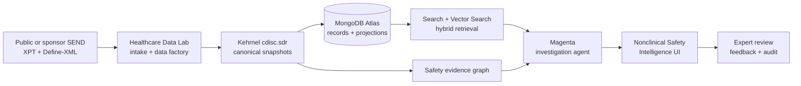

# AI-Ready Nonclinical Safety Intelligence

An interactive reference application for investigating nonclinical safety signals across CDISC SEND studies with MongoDB, Kehrnel, and the MongoDB Agentic Platform (Magenta).

The application starts with the question a toxicologist actually asks:

> Is this finding treatment-related, dose-responsive, biologically coherent, and traceable to its source evidence?

It then progressively reveals the data model, governed queries, hybrid retrieval, evidence graph, and agent execution that produced the answer.

## What You Can Explore

- A visual organ-level signal landscape ranked for expert review.
- Dose-response and longitudinal laboratory charts.
- Cross-domain links between SEND DM, TX, MI, and LB records.
- An interactive evidence and lineage graph built with React Flow.
- A read-only AI investigator that exposes its retrieval plan and citations.
- A technical view explaining the boundary between the solution, Healthcare Data Lab, Kehrnel, MongoDB Atlas, and Magenta.

The included demonstration uses deterministic aggregates from the public [PhUSE SENDConform FFU contribution](https://github.com/phuse-org/SENDConform), pinned to revision `eb438ce3f7cbd74eea77677f43b916dd46c802cd`. No large XPT files are committed.

## Quick Start

The application runs in fixture mode without MongoDB, Kehrnel, or an LLM:

```bash
npm install
npm run dev
```

Open [http://localhost:3000](http://localhost:3000).

To connect the governed runtime:

```bash
cp .env.example .env.local
# Set SAFETY_DATA_MODE=kehrnel and the KEHRNEL_* values.
npm run dev
```

To use the Magenta safety investigator, also set `MAGENTA_AGENT_URL`. Without it, the same interface uses a deterministic, cited investigation path suitable for demos and tests.

Set `MONGODB_URI` to retain solution-owned investigation sessions for 90 days. This collection contains review interaction state only; canonical SEND records remain governed by Kehrnel.

## Architecture



### Separation of concerns

| Component | Responsibility |
|---|---|
| Healthcare Data Lab | Create, ingest, validate, inspect, and experiment with study data and queries. |
| Kehrnel | Own the CDISC model, deterministic generation, immutable snapshots, validation, governed query contracts, projections, and lineage. |
| MongoDB Atlas | Store operational documents and derived views; execute structured, lexical, vector, and graph-style aggregations. |
| Magenta | Orchestrate read-only investigation tools, memory, traces, reranking, and human review. |
| This repository | Deliver the business workflow, visual explanation, evidence assembly, and expert experience. |

The solution never makes canonical CDISC records or agent memory competing sources of truth.

## Data Modes

### Fixture

`SAFETY_DATA_MODE=fixture` is the default. It provides a fully interactive experience from checked-in, traceable aggregates. It is deterministic and requires no credentials.

### Kehrnel

`SAFETY_DATA_MODE=kehrnel` binds the application to an activated `cdisc.sdr` environment. The first implementation resolves canonical study identity and snapshot scope through Kehrnel while retaining the same presentation contract. Portfolio materializations can replace the fixture read model without changing UI components.

## AI Retrieval Design

The investigator is deliberately hybrid:

1. Bind tenant, study, and immutable snapshot.
2. Execute exact governed aggregation for counts and measurements.
3. Retrieve semantically related findings and narratives with Atlas Search and Vector Search.
4. Expand explicit entity and lineage edges.
5. Fuse candidates using reciprocal-rank fusion.
6. Apply a second-stage reranker.
7. Generate a review hypothesis with record-level citations.

The agent is read-only. It cannot publish snapshots, create validation waivers, supersede evidence, or claim regulatory compliance.

## Repository Structure

```text
app/                  Next.js pages and server-side API routes
components/           Interactive safety visualizations and agent UI
data/                 Small, attributed demonstration read model
lib/analysis/         Deterministic review-priority calculations
lib/ai/               Magenta adapter and deterministic fallback
lib/data/             Fixture and Kehrnel providers
lib/data/review-store Optional solution-owned MongoDB investigation history
docs/                 Architecture and delivery guidance
tests/                Contract and analysis tests
```

## Validation

```bash
npm test
npm run build
```

## Product Roadmap

1. **Single-study SEND investigation** — implemented foundation.
2. **Connected Atlas AI retrieval** — embeddings, indexes, reranker, evaluation set.
3. **Cross-study portfolio intelligence** — compound, target organ, species, and historical-control comparisons.
4. **Translational safety bridge** — governed connections from nonclinical SEND to clinical SDTM and ADaM evidence.

## Safety and Scope

This project is a reference architecture and demonstration. It is not a validated toxicology system, statistical analysis package, regulatory submission authoring tool, or autonomous decision maker. All generated interpretations require qualified expert review.

## License

Apache License 2.0. The source datasets retain their original licenses and attribution requirements.
