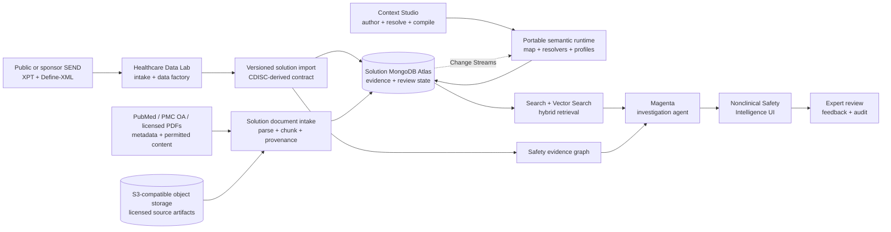

# AI-Ready Nonclinical Safety Intelligence

An interactive, self-contained reference application for investigating nonclinical safety signals across CDISC SEND studies with MongoDB and the MongoDB Agentic Platform (Magenta).

The application starts with the question a toxicologist actually asks:

> Is this finding treatment-related, dose-responsive, biologically coherent, and traceable to its source evidence?

It then progressively reveals the data model, governed queries, hybrid retrieval, evidence graph, and agent execution that produced the answer.

The in-product **Solution architecture** workspace and [full architecture guide](docs/solution-architecture.md) show exactly where CDISC is used, how SEND domains become traceable MongoDB documents, which APIs form the runtime boundary, and how search, embeddings, graph traversal, semantic resolution, and Magenta work together. The [vertical expansion program](docs/vertical-expansion-program.md) defines the evidence-first path from the current signal-triage experience to a cross-domain target-organ assessment and expert-controlled NOAEL workbench.

## Reusable patterns

The data-architecture decisions behind this solution are extracted into
[`patterns/`](patterns/) so they can be lifted into another project without
reading the application: the polymorphic canonical record envelope,
authorization-first index prefixes, bounded retrieval projections, reconciled
derived read models, rebuildable semantic projections, and the separation of
immutable evidence from agent and reviewer state. Each pattern states the
problem, the shape, why it works, and **when not to use it**.

## What You Can Explore

- A seven-chapter guided journey for non-experts covering the scientific purpose, roles, SEND evidence, signal triage, AI investigation, semantic resolution, and audit trail. See the [companion guide](docs/guided-journey.md).
- A study-wide dose-by-organ incidence matrix and organ signal landscape ranked for expert review.
- A separate portfolio similarity atlas with interactive cross-study graphs, explainable retrieval lanes, and evidence-class boundaries.
- Dose-response and longitudinal laboratory charts.
- Cross-domain evidence across all 25 imported PDS2014 SEND datasets, including DM, TX, MI, MA, OM, BW/BG, LB, CL, EX, PC/PP, SE/DS, and source-declared RELREC links.
- A full-width interactive evidence and lineage network with dose-specific branches, node inspection, minimap, and immersive graph mode.
- A full-screen Investigation Room with an interactive evidence-path navigator and an optional AI-first canvas where the investigator composes typed graph, dose-response, laboratory, semantic-clarification, and resolver widgets while exposing citations.
- An inspectable execution envelope for every investigation: the authorized deterministic resolver contract, immutable query scope, server-selected typed widgets, real MongoDB `executionStats` (winning index, keys/documents examined, rows returned, and duration), and every structured, graph, semantic, vector, literature, fusion, and reranking stage that actually executed, fell back, or was skipped.
- Record-level drilldown from a signal to its contributing evidence, followed by a paginated canonical explorer across every imported domain, subject or complete-study scope, and checksum-verified source artifact. Laboratory rows can be filtered by finding-linked test, source-supplied abnormality/range evidence, or unavailable reference range without inventing clinical thresholds.
- A literature-evidence workspace that grounds SEND findings to attributed PubMed records, separates supporting context from alternative explanations, and exposes the hybrid retrieval path.
- A profile-aware semantic model explorer with synchronized business-document, semantic-graph, retrieval, and physical-MongoDB lenses, plus live hybrid search across the map itself.
- A governed target-organ assessment that requires explicit endpoint citations and separately records target-organ conclusion, adversity, reversibility, rationale, semantic release, and approval state without mutating SEND evidence.
- A live semantic change lab that shows a newly observed terminology value flowing through Change Streams, validation, compilation, profile projection, and map refresh.
- A technical view explaining the boundary between the deployed solution and upstream HDL/Kehrnel enablement.

The default connected demonstration is the public **PDS2014** study from [PhUSE SENDConform](https://github.com/phuse-org/SENDConform), pinned to revision `eb438ce3f7cbd74eea77677f43b916dd46c802cd`. Its 25 datasets and 42,041 canonical records drive the adrenal-gland vacuolization vertical. The storage-conscious connected corpus also includes Nimort-01 and PointCross; FFU and Instem GLP003 remain reproducible, reloadable source examples rather than permanently materialized Atlas studies. A reproducible [public SEND evidence profile](docs/evidence/cdisc-public-study-profile.md) documents the selection. No large XPT files are committed.

## Quick Start

The application runs in fixture mode without MongoDB or an LLM:

```bash
npm install
npm run dev
```

Open [http://localhost:3000](http://localhost:3000).

### Demo Sherpa

The application embeds Demo Sherpa from the committed
`vendor/demo-sherpa-0.1.2.tgz` package, so local and container builds do not
depend on a sibling checkout or private package registry. On first browser
load, the host seeds an editable eight-step journey named **From SEND evidence
to a defensible safety hypothesis**. A newer bundled seed migrates an older
revision once; edits to the current revision are then preserved.

The seed is deliberately text-first. Each step contains ordered narration
segments, explicit pause units, stable host actions, and UI checkpoints. With
no service configured, playback uses browser speech. To generate and retain
segment audio later, configure the optional Sherpa catalog and speech endpoints
from `.env.example`, then use **Nonclinical Safety Journey Studio**.

The host integration lives under `components/sherpa/`; the application exposes
stable `data-sherpa-action` and `data-sherpa-state` attributes for recording and
checkpoint-gated replay. Set `NEXT_PUBLIC_SHERPA_ENABLED=false` to disable the
floating guide without removing the integration.

When the sibling Demo Sherpa package version changes, build and pack it from
`../demo-sherpa`. This repository is registered in its `scripts/syncDemos.mjs`
distribution list; running `make sync` there refreshes the vendored package.

To persist the demonstration and investigation history in your own MongoDB deployment:

```bash
cp .env.example .env.local
# Set MONGODB_URI. The public demonstration is bootstrapped automatically.
npm run dev
```

The default local command uses the deterministic cited investigator. The agent vendors the approved Magenta runtime wheels in the repository, so no external Magenta URL, Kehrnel URL, or GitHub token is required.

### Activating the bundled Magenta agent

The agent needs two things: the solution database and an LLM key.

```bash
# .env.local
MONGODB_URI=mongodb+srv://...
OPENAI_API_KEY=sk-...
OPENAI_MODEL=gpt-4o-mini        # must be a model your key can call
INTERNAL_AGENT_URL=http://localhost:8082   # only when running the app outside compose
```

```bash
docker compose up --build       # starts the app and the agent together
```

Confirm what is actually running — the endpoint probes both dependencies rather than
inferring them from configuration:

```bash
curl -s localhost:3000/api/health | jq '{dataMode, agentMode, agent}'
```

`agent.status` reports one of:

| Status | Meaning |
|---|---|
| `ready` | Magenta is answering investigations |
| `degraded` | The agent process is up but has no `OPENAI_API_KEY`, so it returns HTTP 503 |
| `unreachable` | `INTERNAL_AGENT_URL` is set but nothing answered |
| `not-configured` | No agent URL; the deterministic investigator answers by design |

Without a key the application stays fully usable: the deterministic cited
investigator answers and the UI states *why* — the investigator badge reads
`DETERMINISTIC` rather than `MAGENTA`, and the panel shows the exact reason
(for example, `The agent returned HTTP 503.`). The interface never presents a
fallback as though the agent had run.

Set `MONGODB_URI` to persist study evidence, search chunks, and investigation sessions in the solution database. The application owns these deployed collections and APIs.

Import the checked-in Context Studio runtime release into that database with:

```bash
npm run import:semantics
```

The application remains runnable from the checked-in bundle when MongoDB is unavailable.

## Architecture



### Separation of concerns

| Component | Responsibility |
|---|---|
| Healthcare Data Lab + Kehrnel | Upstream learning and enablement: create/ingest data, validate the model, test query patterns, and export a versioned solution input. They are not runtime dependencies. |
| Context Studio | Author, resolve, test, and compile the semantic map into a portable runtime package. It is a build-time dependency, not a production service dependency. |
| MongoDB Atlas | The deployed solution database: study and literature evidence documents, search/vector projections, semantic links, investigation history, and reviewer state. |
| PubMed, PMC and object storage | PubMed contributes bibliographic identity and abstracts; PMC Open Access or sponsor-licensed storage contributes permitted full text. Source artifacts remain separately governed and attributable. |
| Bundled Magenta service | Orchestrate solution-owned read-only tools, memory, traces, reranking, and human review within the same deployment. |
| This repository | Deliver the business workflow, visual explanation, evidence assembly, and expert experience. |

The solution never makes canonical CDISC records, semantic projections, or agent memory competing sources of truth. Published evidence is immutable; semantic releases are versioned; expert decisions are append-only solution state.

## Portable Semantic Runtime

[`semantic/nonclinical-safety-runtime.json`](semantic/nonclinical-safety-runtime.json) is the deployable output of Context Studio. It contains:

- business and evidence objects plus typed relationships;
- taxonomy concepts, terminology/value-set bindings, synonyms, and broader/narrower hierarchy;
- reusable archetypes with roles and cardinalities, separate from physical persistence;
- explicit storage bindings showing every MongoDB, API, or object-store representation and its authority;
- profile-filtered visibility, field masks, capabilities, and actions;
- resolver contracts for aggregation, graph lookup, hybrid vector search, reranking, and Magenta synthesis;
- domain-owned resolver contracts, including a nonclinical safety investigator that binds the exact study, snapshot, signal, profile, and question before any tool executes;
- terminology value sets and four synchronized UI surface definitions;
- a snapshot + cursor + event subscription contract backed by MongoDB Change Streams.
- portable source-adapter declarations for MongoDB, PubMed, PMC Open Access, and S3-compatible document storage.

With MongoDB configured, the semantic API resolves the active release from `semantic_runtime_pointer`. The importer also builds one polymorphic `semantic_resources` projection, a separate `semantic_edges` traversal projection, and `semantic_search_documents`. The latter is indexed with Atlas Automated Embedding, so semantic-map vectors live in `__mdb_internal_search` rather than appearing as fields in Compass. `/api/semantics/search` combines profile-scoped lexical and vector candidates with reciprocal-rank fusion. The change lab creates a candidate event, compiles a new immutable bundle, materializes all three projections, activates its pointer, and lets connected clients refresh from the emitted resume-safe event. Fixture mode performs the identical visual workflow against the bundled release without pretending to persist it.

The application imports that artifact; it never imports Context Studio internals. A production identity provider must supply the profile—this demonstrator exposes a profile picker so the authorization projections are visible.

The source package also contains a portable Context Studio workspace blueprint. It defines four independent layers—semantics, archetypes, placements, and interfaces—so the same meaning can be bound to multiple physical representations without treating storage as ontology. A live Context Studio installation can install the package into a governed workspace, compile an immutable release, and export this runtime bundle; the application does not require that workspace at runtime.

## Data Modes

### Fixture fallback

Without `MONGODB_URI`, the application provides a fully interactive experience from checked-in, traceable aggregates. It is deterministic and requires no credentials. The portfolio workspace adds three compact benchmark projections generated from Kehrnel CDISC synthetic data factory `2.1.0` using the `safety-signal` recipe and seeds `42`, `117`, and `203`. Their recipe and model digests are retained, and the UI labels them as synthetic evaluation data everywhere.

### MongoDB

When `MONGODB_URI` is set, the application reads its own canonical evidence, operational read models, retrieval projections, and solution-state collections. The bundled public study summary is inserted idempotently only when no connected projection has been imported. A Kehrnel export populates `study_snapshots`, `dataset_definitions`, `cdisc_records`, `subjects`, `source_artifacts`, `validation_evidence`, and `lineage_events` without coupling the running solution to Kehrnel.

The verified active public corpus exercises **63,836 canonical records and 374 animals across three complete studies**. PDS2014 contributes 42,041 records and 124 animals; PointCross contributes the strongest cross-study comparator; and Nimort-01 supplies the only current public example with populated laboratory range evidence. The study selector opens every retained active immutable snapshot as a complete workspace, and the portfolio atlas compares their bounded pathology projections alongside clearly separated synthetic benchmarks. `study_snapshot_pointers` activates a new immutable version only after import and reconciliation succeed. On this shared demonstration cluster, inactive snapshots and lower-value fully materialized studies are pruned after verification; their checksum-pinned Kehrnel packages remain reloadable. Kehrnel exposes those source packages with revision, license, checksums, and validation findings retained in every export.

Kehrnel emits `kehrnel.dev/cdisc-solution-evidence/v1` from the `cdisc_export_solution_evidence` operation. Its checked-in contract is [`contracts/cdisc-solution-evidence-v1.schema.json`](contracts/cdisc-solution-evidence-v1.schema.json). Download the generated JSON artifact, then import it:

```bash
npm run import:study -- ./path/to/solution-evidence-package.json
# For a package intentionally generated as an evaluation benchmark:
npm run import:study -- ./path/to/synthetic-package.json --evidence-class=synthetic-benchmark
npm run import:literature
npm run rebuild:portfolio
npm run setup:indexes
```

Published snapshot identifiers are immutable by default. A controlled staging
migration may pass `--replace-snapshot` to rebuild one exact study/snapshot
mirror from a newly verified package. Replacement is refused when an
investigation, review action, or target-organ assessment already references the
snapshot, and the prior package receipt is retained as superseded.

```bash
npm run import:study -- ./path/to/solution-evidence-package.json --replace-snapshot
```

The importer verifies API and model versions, requires a published snapshot, recomputes the package SHA-256 digest, checks every manifest count, and performs bounded, retryable, idempotent upserts. Across the three retained active studies it deterministically derives 6,673 endpoint summaries, 786 measurement series, 374 subject timelines, and 60,045 typed evidence relationships. Every projection carries exact source-record IDs, a deterministic digest, projection version, and the semantic release used to interpret it. Source-declared RELREC edges remain distinguishable from governed joins. There is no manually supplied second data model in connected mode.

Laboratory abnormality is source-governed: the resolver hydrates canonical LB rows only when the source supplies limits or an abnormality flag, reports low/high/flagged counts and overlap with selected pathology animals, and lets the investigator open those exact rows. PDS declares standard range columns but leaves them unpopulated; Nimort-01 provides the current live example. Cohort statistics are never converted into invented normal limits.

The index command creates the solution-owned Atlas Search and Vector Search definitions described in [`docs/atlas-indexes.md`](docs/atlas-indexes.md). It requires an Atlas database role permitted to manage search indexes.

## AI Retrieval Design

The investigator is deliberately hybrid. These lanes execute inside one server-side
investigation envelope; the browser does not invent or separately claim a retrieval
plan:

1. Bind tenant, study, and immutable snapshot.
2. Execute exact governed aggregation for counts and measurements.
3. Retrieve semantically related findings and narratives with Atlas Search and Vector Search.
4. Expand explicit entity and lineage edges.
5. Fuse candidates using reciprocal-rank fusion.
6. Apply a second-stage reranker.
7. Generate a review hypothesis with record-level citations.

### External literature evidence

Literature is a separate contextual-evidence lane. The demonstration includes verified PubMed records linked only where organ, morphology, species, study design, and explanatory role match. It stores bibliographic metadata and application-authored relevance summaries only—never unlicensed article text—and shows zero results rather than borrowing unrelated evidence for the selected PDS finding.

For a production corpus, source PDFs live in governed S3-compatible object storage. The solution stores parsed, section-aware chunks, semantic links, page or passage locators, content hashes, and access policy in MongoDB. Atlas Automated Embedding stores generated vectors in its reserved internal database rather than adding arrays to those application documents. Full text is ingested only from PMC Open Access or material for which the deployer has permission. PubMed identifiers and source links remain attached to every retrieved passage.

The literature resolver performs concept grounding, license filtering, lexical search, vector search, graph expansion, and domain reranking. Its output is labeled as pathology reference, analogous pattern, or alternative explanation. It cannot turn literature similarity into a compound-specific or causal conclusion.

`GET /api/literature` executes that contract rather than merely describing it. It validates the active profile and containment plan, scopes candidates to the selected finding, uses the configured Atlas Search index, sends query text directly through Atlas Automated Embedding, expands materialized semantic evidence edges, performs reciprocal-rank fusion and domain reranking, and returns per-stage execution telemetry. If the Atlas Preview feature is unavailable, the response identifies the fallback lane and retains the governed exact result set.

The agent is read-only. It cannot publish snapshots, create validation waivers, supersede evidence, or claim regulatory compliance.

### Portfolio similarity

`GET /api/portfolio/similarity` authorizes `retrieve-similar-findings` against the active semantic profile and compares the selected finding only with other study snapshots. The resolver executes semantic/concept, normalized dose-incidence, severity, and Atlas Automated Embedding lanes. Candidate lists are fused with reciprocal-rank fusion and then domain-reranked. The response exposes every lane score, target-organ/species/strain/SEND/domain comparability, whether Vector Search actually ran, and the exact data-operation traces used for the answer.

The shipped benchmark corpus is for evaluating the workflow, never for historical-control or scientific inference. When real sponsor or public study packages are imported, the same resolver compares their solution-owned projections without changing the UI contract. Compound and SMILES similarity are intentionally absent until a governed compound identity and structure source are available.

## Repository Structure

```text
app/                  Next.js pages and server-side API routes
components/           Interactive safety visualizations and agent UI
data/                 Small, attributed demonstration read model
lib/analysis/         Deterministic review-priority calculations
lib/ai/               Magenta adapter and deterministic fallback
lib/data/             MongoDB repositories and fixture bootstrap
lib/data/review-store Optional solution-owned MongoDB investigation history
lib/semantics/        Portable semantic runtime loader and profile projection
semantic/             Context Studio-compiled runtime release
services/agent/       Bundled Magenta investigation service
docs/                 Architecture and delivery guidance
patterns/             Reusable MongoDB data-architecture patterns, extracted to copy
tests/                Contract and analysis tests
```

## Validation

```bash
npm test
npm run build
```

## Product Roadmap

1. **Single-study SEND investigation** — implemented foundation.
2. **Connected Atlas AI retrieval** — executable containment, Atlas Search, Atlas Automated Embedding, graph expansion, fusion, reranking and visible plan telemetry are implemented; expert-labeled retrieval evaluation remains.
3. **Cross-study portfolio intelligence** — implemented across three deliberately differentiated complete public SEND studies plus segregated synthetic benchmarks, with explainable target-organ, species, strain, SEND-profile, domain-coverage, dose-pattern, severity, and Atlas Automated Embedding comparisons. Comparators remain contextual and are never silently pooled as historical controls. Compound/SMILES similarity remains deferred until governed compound identities and structures are supplied.
4. **Translational safety bridge** — governed connections from nonclinical SEND to clinical SDTM and ADaM evidence.

## Safety and Scope

This project is a reference architecture and demonstration. It is not a validated toxicology system, statistical analysis package, regulatory submission authoring tool, or autonomous decision maker. All generated interpretations require qualified expert review.

## License

Apache License 2.0. The source datasets retain their original licenses and attribution requirements.
