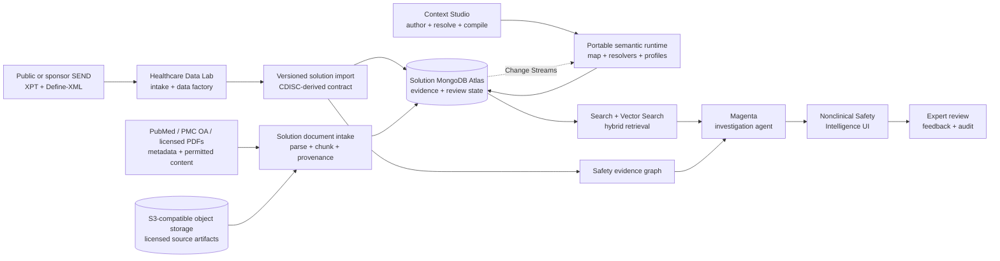

# AI-Ready Nonclinical Safety Intelligence

An interactive, self-contained reference application for investigating nonclinical safety signals across CDISC SEND studies with MongoDB and the MongoDB Agentic Platform (Magenta).

The application starts with the question a toxicologist actually asks:

> Is this finding treatment-related, dose-responsive, biologically coherent, and traceable to its source evidence?

It then progressively reveals the data model, governed queries, hybrid retrieval, evidence graph, and agent execution that produced the answer.

## What You Can Explore

- A study-wide dose-by-organ incidence matrix and organ signal landscape ranked for expert review.
- Dose-response and longitudinal laboratory charts.
- Cross-domain links between SEND DM, TX, MI, and LB records.
- A full-width interactive evidence and lineage network with dose-specific branches, node inspection, minimap, and immersive graph mode.
- A full-screen Investigation Room where the AI investigator conducts typed graph, dose, laboratory, and resolver widgets while exposing citations.
- A literature-evidence workspace that grounds SEND findings to attributed PubMed records, separates supporting context from alternative explanations, and exposes the hybrid retrieval path.
- A profile-aware semantic model explorer with synchronized business-document, semantic-graph, retrieval, and physical-MongoDB lenses.
- Governed review actions stored separately from immutable SEND evidence.
- A live semantic change lab that shows a newly observed terminology value flowing through Change Streams, validation, compilation, profile projection, and map refresh.
- A technical view explaining the boundary between the deployed solution and upstream HDL/Kehrnel enablement.

The included demonstration uses deterministic aggregates from the public [PhUSE SENDConform FFU contribution](https://github.com/phuse-org/SENDConform), pinned to revision `eb438ce3f7cbd74eea77677f43b916dd46c802cd`. No large XPT files are committed.

## Quick Start

The application runs in fixture mode without MongoDB or an LLM:

```bash
npm install
npm run dev
```

Open [http://localhost:3000](http://localhost:3000).

To persist the demonstration and investigation history in your own MongoDB deployment:

```bash
cp .env.example .env.local
# Set MONGODB_URI. The public demonstration is bootstrapped automatically.
npm run dev
```

The default local command uses the deterministic cited investigator. `docker compose up --build` starts the application and its bundled Magenta service together; no external Magenta URL, Kehrnel URL, or GitHub token is required. The agent vendors the approved Magenta runtime wheels in the repository, following the same deployment pattern as `patient-access-coordination-advisor`.

Set `MONGODB_URI` to persist study evidence, search chunks, and investigation sessions in the solution database. The application owns these deployed collections and APIs.

Import the checked-in Context Studio runtime release into that database with:

```bash
npm run import:semantics
```

The application remains runnable from the checked-in bundle when MongoDB is unavailable.

## Architecture



### Separation of concerns

| Component | Responsibility |
|---|---|
| Healthcare Data Lab + Kehrnel | Upstream learning and enablement: create/ingest data, validate the model, test query patterns, and export a versioned solution input. They are not runtime dependencies. |
| Context Studio | Author, resolve, test, and compile the semantic map into a portable runtime package. It is a build-time dependency, not a production service dependency. |
| MongoDB Atlas | The deployed solution database: study and literature evidence documents, search/vector projections, semantic links, investigation history, and reviewer state. |
| PubMed, PMC and object storage | PubMed contributes bibliographic identity and abstracts; PMC Open Access or sponsor-licensed storage contributes permitted full text. Source artifacts remain separately governed and attributable. |
| Bundled Magenta service | Orchestrate solution-owned read-only tools, memory, traces, reranking, and human review within the same deployment. |
| This repository | Deliver the business workflow, visual explanation, evidence assembly, and expert experience. |

The solution never makes canonical CDISC records, semantic projections, or agent memory competing sources of truth. Published evidence is immutable; semantic releases are versioned; expert decisions are append-only solution state.

## Portable Semantic Runtime

[`semantic/nonclinical-safety-runtime.json`](semantic/nonclinical-safety-runtime.json) is the deployable output of Context Studio. It contains:

- business and evidence objects plus typed relationships;
- taxonomy concepts, terminology/value-set bindings, synonyms, and broader/narrower hierarchy;
- reusable archetypes with roles and cardinalities, separate from physical persistence;
- explicit storage bindings showing every MongoDB, API, or object-store representation and its authority;
- profile-filtered visibility, field masks, capabilities, and actions;
- resolver contracts for aggregation, graph lookup, hybrid vector search, reranking, and Magenta synthesis;
- terminology value sets and four synchronized UI surface definitions;
- a snapshot + cursor + event subscription contract backed by MongoDB Change Streams.
- portable source-adapter declarations for MongoDB, PubMed, PMC Open Access, and S3-compatible document storage.

With MongoDB configured, the semantic API resolves the active release from `semantic_runtime_pointer`. The change lab creates a candidate event, compiles a new immutable bundle, activates its pointer, and lets connected clients refresh from the emitted resume-safe event. Fixture mode performs the identical visual workflow against the bundled release without pretending to persist it.

The application imports that artifact; it never imports Context Studio internals. A production identity provider must supply the profile—this demonstrator exposes a profile picker so the authorization projections are visible.

The source package also contains a portable Context Studio workspace blueprint. It defines four independent layers—semantics, archetypes, placements, and interfaces—so the same meaning can be bound to multiple physical representations without treating storage as ontology. A live Context Studio installation can install the package into a governed workspace, compile an immutable release, and export this runtime bundle; the application does not require that workspace at runtime.

## Data Modes

### Fixture fallback

Without `MONGODB_URI`, the application provides a fully interactive experience from checked-in, traceable aggregates. It is deterministic and requires no credentials.

### MongoDB

When `MONGODB_URI` is set, the application reads its own `study_evidence` and `evidence_chunks` collections, retains investigations, and exposes its own API. The bundled public study is inserted idempotently on first use. Future Kehrnel or HDL exports target this same versioned import contract without coupling the running solution to either tool.

Import another solution-ready snapshot with:

```bash
npm run import:study -- ./path/to/study-evidence.json
npm run import:literature
npm run setup:indexes
```

The import is idempotent by study and snapshot. It is the deployment handoff point for data prepared in HDL/Kehrnel or another validated pipeline.

The index command creates the solution-owned Atlas Search and Vector Search definitions described in [`docs/atlas-indexes.md`](docs/atlas-indexes.md). It requires an Atlas database role permitted to manage search indexes.

## AI Retrieval Design

The investigator is deliberately hybrid:

1. Bind tenant, study, and immutable snapshot.
2. Execute exact governed aggregation for counts and measurements.
3. Retrieve semantically related findings and narratives with Atlas Search and Vector Search.
4. Expand explicit entity and lineage edges.
5. Fuse candidates using reciprocal-rank fusion.
6. Apply a second-stage reranker.
7. Generate a review hypothesis with record-level citations.

### External literature evidence

Literature is a separate contextual-evidence lane. The demonstration includes three verified PubMed records linked to the thymus finding by organ, morphology, species, study design, and explanatory role. It stores bibliographic metadata and application-authored relevance summaries only—never unlicensed article text.

For a production corpus, source PDFs live in governed S3-compatible object storage. The solution stores parsed, section-aware chunks, embeddings, semantic links, page or passage locators, content hashes, and access policy in MongoDB. Full text is ingested only from PMC Open Access or material for which the deployer has permission. PubMed identifiers and source links remain attached to every retrieved passage.

The literature resolver performs concept grounding, license filtering, lexical search, vector search, graph expansion, and domain reranking. Its output is labeled as pathology reference, analogous pattern, or alternative explanation. It cannot turn literature similarity into a compound-specific or causal conclusion.

The agent is read-only. It cannot publish snapshots, create validation waivers, supersede evidence, or claim regulatory compliance.

## Repository Structure

```text
app/                  Next.js pages and server-side API routes
components/           Interactive safety visualizations and agent UI
data/                 Small, attributed demonstration read model
lib/analysis/         Deterministic review-priority calculations
lib/ai/               Magenta adapter and deterministic fallback
lib/data/             MongoDB repositories and fixture bootstrap
lib/data/review-store Optional solution-owned MongoDB investigation history
lib/semantics/        Portable semantic runtime loader and profile projection
semantic/             Context Studio-compiled runtime release
services/agent/       Bundled Magenta investigation service
docs/                 Architecture and delivery guidance
tests/                Contract and analysis tests
```

## Validation

```bash
npm test
npm run build
```

## Product Roadmap

1. **Single-study SEND investigation** — implemented foundation.
2. **Connected Atlas AI retrieval** — embeddings, indexes, reranker, evaluation set.
3. **Cross-study portfolio intelligence** — compound, target organ, species, and historical-control comparisons.
4. **Translational safety bridge** — governed connections from nonclinical SEND to clinical SDTM and ADaM evidence.

## Safety and Scope

This project is a reference architecture and demonstration. It is not a validated toxicology system, statistical analysis package, regulatory submission authoring tool, or autonomous decision maker. All generated interpretations require qualified expert review.

## License

Apache License 2.0. The source datasets retain their original licenses and attribution requirements.
