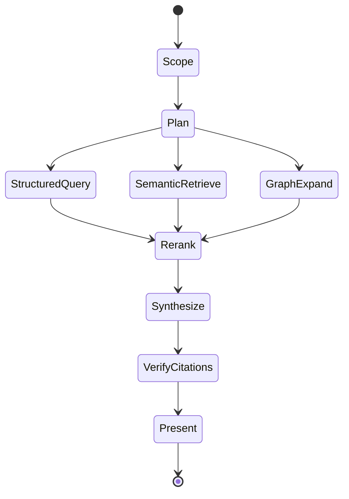

# Agentic Safety Investigation

The target agent is an evidence coordinator, not a toxicologist replacement.

## Retrieval lanes

- **Structured:** incidence, distinct animals, severity, dose, time, and laboratory values through solution-owned MongoDB queries learned and verified upstream in Kehrnel.
- **Lexical:** exact finding names, controlled terminology, variables, and source metadata.
- **Vector:** semantic similarity across normalized finding descriptions, study narratives, and prior reviewed signals.
- **Graph:** compound → study → group → animal → specimen → finding → measurement → source artifact.

Candidate evidence is fused with reciprocal-rank fusion, then reranked against the investigation question and current study context. Structured facts keep their exact values and are never replaced by generated text.

## Agent graph

## Guardrails

- Every tool call is database-, study-, and snapshot-scoped.
- The default tool set is read-only.
- Every assertion must cite canonical evidence or a named derived projection.
- The interface presents tool activity and retrieval evidence, not hidden chain-of-thought.
- Agent memory can retain user preferences and reviewed interpretations, never silently modify source evidence.
- Regulatory conclusions and write operations require explicit expert workflows outside this first release.
