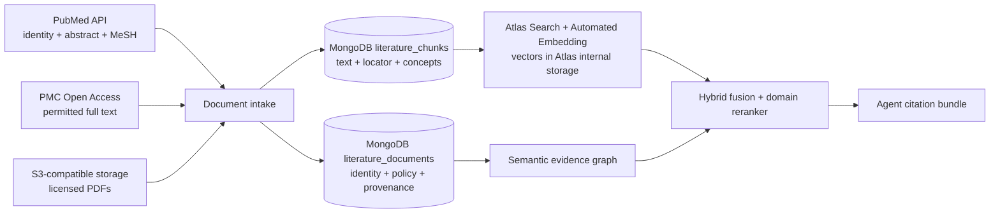
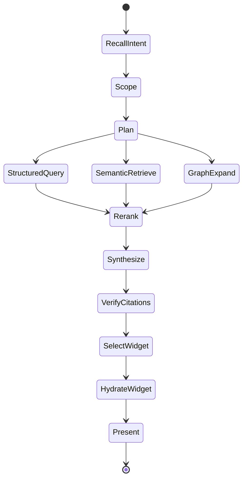

# Agentic Safety Investigation

The target agent is an evidence coordinator, not a toxicologist replacement.

## Retrieval lanes

- **Structured:** incidence, distinct animals, severity, dose, time, and laboratory values through solution-owned MongoDB queries learned and verified upstream in Kehrnel.
- **Lexical:** exact finding names, controlled terminology, variables, and source metadata.
- **Vector:** semantic similarity across normalized finding descriptions, study narratives, and prior reviewed signals.
- **Graph:** compound → study → group → animal → specimen → finding → measurement → source artifact.
- **Literature:** finding → publication → licensed passage → contextual assertion, grounded by terminology and filtered by content rights.

Candidate evidence is fused with reciprocal-rank fusion, then reranked against the investigation question and current study context. Structured facts keep their exact values and are never replaced by generated text.

The Investigation Room presents the compiled resolver contract separately from the execution trace. The contract states the authorized capability, semantic release, policies, bounded study/snapshot/signal predicate, declared stages, exact read collections, and separate audit write. The trace records which stages actually completed, fell back, or were skipped. Connected MongoDB reads also attach real `executionStats` summaries—the winning index, keys and documents examined, rows returned, and duration—to the corresponding data operation. Fixture and unavailable-explain paths are labeled explicitly and never presented as measured database execution.

In AI-first mode the conversation conducts a full-width visual canvas instead of replacing it. Answers compose dose-response, laboratory, evidence-topology, semantic-grounding, and execution widgets inline with the explanation. The right inspector is opened only for a user-selected chart or publication. Hybrid semantic candidates expose their hierarchy and value-set context; the investigator can choose an intended meaning, rerun the question with that governed interpretation, or open the selected object in the full semantic-map explorer.

## Two context planes

The investigator deliberately separates conversational context from evidence context:

- **Session memory** stores dialogue continuity: the user's focus, prior questions, requested comparisons, and preferred presentation. It is bound to one study, snapshot, signal, profile, and semantic release. The bundled deployment persists Magenta checkpoints with a configurable TTL.
- **Deterministic context** stores the authorized resolver contract and fresh results: canonical facts, semantic release, executed MongoDB operations, citations, and available visual renderers. Memory is never accepted as evidence.

For each turn Magenta interprets the question with memory, calls one or more registered resolver tools for facts that are not present in the current deterministic context, and finally calls `present_evidence_widget`. That presentation tool returns a schema-versioned receipt containing only a widget kind and bound scope. The Next.js application validates the receipt and hydrates the chart, graph, or plan from deterministic resolver output. A model therefore chooses *how to explain*; it cannot invent the values being visualized.

The adjacent Evidence Workspace uses progressive disclosure. Its overview answers
which SEND dimensions are present and why each dimension matters to the active
finding. Focused tabs then expose BW/BG, FW, LB, MI/MA, OM, EX, PC/PP, and
CL/SE/DS without repeating every domain on every screen. Visual marks retain the
source-record identities used to calculate them; selecting a mark executes a
bounded canonical lookup and exposes that lookup's measured query plan.

Resolvers are extensible semantic products, not a closed list of generic APIs. Context Studio owns the portable resolver schema and compiler boundary; an industry package can add resolvers such as `resolver.investigate-safety-signal.v1` with domain-specific containment, policies, stages, and result types. The solution binds those contracts to its own adapters. This follows the useful openEHR RPS-dual principle—preserve governed meaning, compile paths for the workload, and keep optimized projections rebuildable—without requiring this nonclinical model to become openEHR.

### AQL containment and hybrid retrieval

AQL is an openEHR query language; MongoDB does not execute it natively. Context Studio therefore compiles the useful semantic part—`CONTAINS` relationships between archetypes—into a portable `contextobjects-containment-v1` plan. An openEHR binding may render native AQL. This solution renders the same scope as MongoDB aggregation and graph traversal, then applies Atlas Search and Vector Search in parallel, reciprocal-rank fusion, and a domain reranker. This preserves archetype meaning without coupling the semantic model to one physical query language.

## Document evidence plane

Context Studio compiles source-adapter and resolver contracts; it does not become the production content gateway. The deployed solution connects those contracts to its own adapters:

Every passage carries its parent publication, source locator, content-rights status, checksum, and semantic concept bindings. Retrieval rejects content outside the active user profile and permitted corpus before scoring. Study observations and external literature are never collapsed into the same evidence class: the former is observed study evidence; the latter is contextual support, analogy, or an alternative explanation.

The deployed literature adapter returns an execution envelope alongside its results. Every declared stage is marked `executed`, `fallback`, or `skipped`, with candidate count, latency and explanation. The UI therefore distinguishes a genuinely executed Atlas Automated Embedding lane from a deployment where the Preview feature or its index is unavailable. This is operational provenance, not simulated agent activity.

## Agent graph

## Guardrails

- Every tool call is database-, study-, and snapshot-scoped.
- The application propagates the active compiled semantic profile into the Magenta request; every tool independently validates its capability grant against the active semantic release.
- The default tool set is read-only.
- Every assertion must cite canonical evidence or a named derived projection.
- The interface presents tool activity and retrieval evidence, not hidden chain-of-thought.
- Agent memory can retain user preferences and reviewed interpretations, but each factual response is rebound to deterministic resolver output for the immutable scope.
- Presentation receipts are accepted only from the registered Magenta tool, at schema `1.0.0`, for a renderer allowed by the server-side catalog and an exact scope match.
- Regulatory conclusions and write operations require explicit expert workflows outside this first release.
