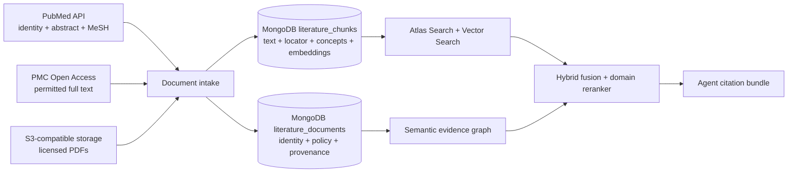
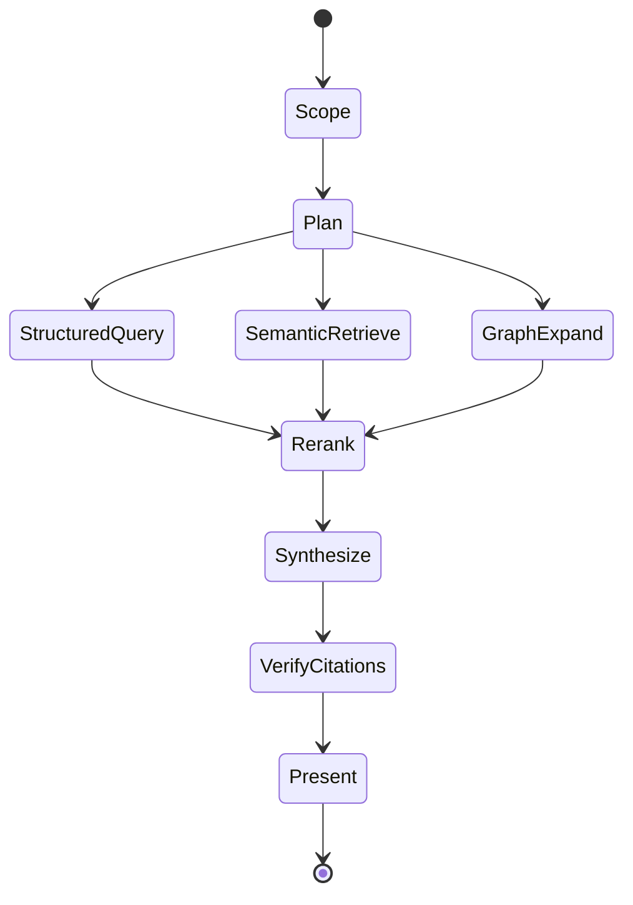

# Agentic Safety Investigation

The target agent is an evidence coordinator, not a toxicologist replacement.

## Retrieval lanes

- **Structured:** incidence, distinct animals, severity, dose, time, and laboratory values through solution-owned MongoDB queries learned and verified upstream in Kehrnel.
- **Lexical:** exact finding names, controlled terminology, variables, and source metadata.
- **Vector:** semantic similarity across normalized finding descriptions, study narratives, and prior reviewed signals.
- **Graph:** compound → study → group → animal → specimen → finding → measurement → source artifact.
- **Literature:** finding → publication → licensed passage → contextual assertion, grounded by terminology and filtered by content rights.

Candidate evidence is fused with reciprocal-rank fusion, then reranked against the investigation question and current study context. Structured facts keep their exact values and are never replaced by generated text.

### AQL containment and hybrid retrieval

AQL is an openEHR query language; MongoDB does not execute it natively. Context Studio therefore compiles the useful semantic part—`CONTAINS` relationships between archetypes—into a portable `contextobjects-containment-v1` plan. An openEHR binding may render native AQL. This solution renders the same scope as MongoDB aggregation and graph traversal, then applies Atlas Search and Vector Search in parallel, reciprocal-rank fusion, and a domain reranker. This preserves archetype meaning without coupling the semantic model to one physical query language.

## Document evidence plane

Context Studio compiles source-adapter and resolver contracts; it does not become the production content gateway. The deployed solution connects those contracts to its own adapters:

Every passage carries its parent publication, source locator, content-rights status, checksum, and semantic concept bindings. Retrieval rejects content outside the active user profile and permitted corpus before scoring. Study observations and external literature are never collapsed into the same evidence class: the former is observed study evidence; the latter is contextual support, analogy, or an alternative explanation.

The deployed literature adapter returns an execution envelope alongside its results. Every declared stage is marked `executed`, `fallback`, or `skipped`, with candidate count, latency and explanation. The UI therefore distinguishes a genuinely executed Vector Search lane from a deployment where the vector index is ready but no embedding provider is configured. This is operational provenance, not simulated agent activity.

## Agent graph

## Guardrails

- Every tool call is database-, study-, and snapshot-scoped.
- The application propagates the active compiled semantic profile into the Magenta request; every tool independently validates its capability grant against the active semantic release.
- The default tool set is read-only.
- Every assertion must cite canonical evidence or a named derived projection.
- The interface presents tool activity and retrieval evidence, not hidden chain-of-thought.
- Agent memory can retain user preferences and reviewed interpretations, never silently modify source evidence.
- Regulatory conclusions and write operations require explicit expert workflows outside this first release.
