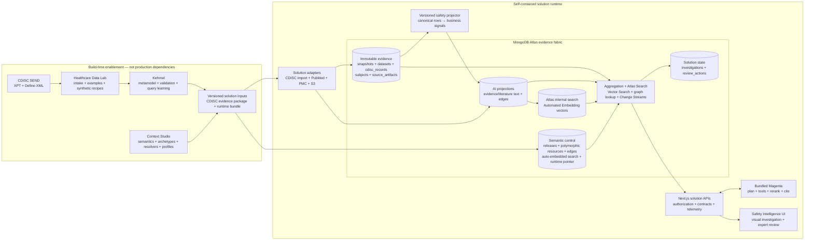

# Solution architecture

## Governing principle

CDISC SEND is the governed source and traceability contract. The deployed MongoDB model is an operational projection of that evidence, not a competing clinical standard. Every derived document retains a study, immutable snapshot, domain, and source reference so it can be traced to checksum-verified XPT and Define-XML artifacts.

## End-to-end architecture



Healthcare Data Lab, Kehrnel, and Context Studio produce versioned inputs. They are intentionally absent from the production request path. The running application owns its MongoDB database, API, Magenta service, policies, and user experience.

## Where CDISC is used

| SEND source | Canonical authority | Operational projection | Purpose |
|---|---|---|---|
| TS | `cdisc_records` domain TS | `study_evidence.study`, `compounds` | Protocol and compound context when TS is present |
| TX | `cdisc_records` domain TX | `study_evidence.doseGroups[]` | Dose, vehicle, and group assignment |
| DM | `cdisc_records` domain DM | `subjects`, group membership in projections | Animal identity, sex, and group |
| MI | `cdisc_records` domain MI | `study_evidence.signals[]` | Organ, morphology, severity, and incidence |
| LB | `cdisc_records` domain LB | `study_evidence.labSeries` | Longitudinal measurements and units |
| XPT + Define-XML | `source_artifacts` plus object storage | Artifact ledger and citations | Definitions, replayability, and integrity |

The primary read model embeds data that the safety workspace reads together:

```javascript
{
  study: { id, snapshotId, implementationGuide },
  doseGroups: [{ code, dose, unit, animalCount }], // TX
  signals: [{ organ, finding, incidence, severity }], // MI
  labSeries: { testCode: { unit, points: [] } }, // LB
  provenance: { sourceRevision, sourceArtifacts }
}
```

This read model is deterministic and rebuildable for a published snapshot. It stores its projector version, projection rule IDs, source package digest, projection digest, and a reconciliation receipt. The underlying `cdisc_records` and source artifacts are immutable authority; `study_evidence`, search documents, and semantic edges are application projections that can evolve or be rebuilt without modifying observed SEND evidence. Atlas maintains Automated Embedding vectors outside the source documents in `__mdb_internal_search`. Investigations and review actions remain separate append-only solution state.

The detailed [CDISC document-model decision](cdisc-document-model-decision.md) defines the target v2 evidence envelope, explains why CDISC uses one polymorphic record collection, and distinguishes the Context Studio release from its solution-side serving projections.

The solution projector is intentionally owned here rather than in Kehrnel. Kehrnel knows how to preserve and export standards-conformant evidence; this application knows which microscopic observations form a safety-review signal, which laboratory series are biologically relevant, and how the user experience consumes them. The boundary keeps reusable data infrastructure independent from product-specific scientific policy.

The visual read model is not an access boundary. The Source records workspace resolves a selected signal to its immediate evidence thread and also exposes a paginated canonical-record API across every domain present in the immutable snapshot. Users can switch between one subject and the complete study, inspect every non-empty canonical field, distinguish canonical data from retrieval facets, and trace each row to its source artifact and hash. Laboratory filters identify the test explicitly linked to the finding and detect values outside source-supplied reference limits or abnormality flags. If the source provides neither, the result is labelled `reference range unavailable`; the solution never invents a threshold.

## API surface

| Method | Route | Responsibility |
|---|---|---|
| GET | `/api/studies/{studyId}/signals` | Retrieve a snapshot-bound study evidence model |
| GET | `/api/studies/{studyId}/signals/{signalId}/records` | Resolve a visual signal to canonical subject, finding, lab, treatment, and artifact evidence |
| GET | `/api/studies/{studyId}/records` | Page through every canonical source row by domain and subject or study scope |
| POST | `/api/investigations` | Execute a profile-authorized, cited investigation and return its compiled contract plus measured data-operation trace |
| GET | `/api/literature` | Execute containment, lexical, Atlas Automated Embedding, graph, fusion, and reranking stages |
| GET | `/api/portfolio/similarity` | Compare a finding across study snapshots with semantic, incidence, severity, Atlas Automated Embedding, fusion, and reranking telemetry |
| GET / POST | `/api/reviews` | Read or append governed expert review actions |
| GET | `/api/semantics` | Return the active semantic runtime projected for a profile |
| GET | `/api/semantics/search` | Run release- and profile-scoped hybrid retrieval over semantic resources and definition edges |
| GET / SSE | `/api/semantics/stream` | Stream resume-safe semantic release and review events |
| POST | `/api/semantics/value-sets/observe` | Validate an observed term and compile a candidate semantic release |
| GET | `/api/health` | Expose configured data, agent, and review-store modes |

The browser only calls solution-owned APIs. It does not connect directly to Kehrnel, Context Studio, MongoDB, or Magenta. This keeps authorization and audit enforcement at a stable boundary while allowing storage and agent internals to evolve.

## Hybrid query path

1. Authorize the profile and bind the study and immutable snapshot.
2. Compile semantic containment from archetypes into an operational MongoDB plan.
3. Execute exact aggregation, Atlas Search, Vector Search, and graph traversal as complementary lanes.
4. Fuse candidates with reciprocal-rank fusion and apply domain-aware reranking.
5. Hydrate canonical records and attach source locators and execution telemetry.
6. Let Magenta synthesize a cited hypothesis for expert acceptance, revision, or rejection.

Exact CDISC-derived measurements remain authoritative. Vector similarity finds context; it never substitutes generated text for incidence, dose, severity, or laboratory values.

## Why the document model matters

- **Fidelity:** source domains, controlled terminology, revisions, and checksums remain explicit.
- **Workload fit:** closely related study facts can be read as one snapshot rather than repeatedly reconstructed from tabular joins.
- **Flexible enrichment:** text chunks, Atlas-managed embedding indexes, relationships, literature, and future molecular projections can be added without changing the standard evidence.
- **Multi-modal retrieval:** the same platform supports exact filters, ranges, full-text search, vector similarity, and graph traversal.
- **Governed agents:** Context Studio profiles determine visible objects, masked fields, tools, and actions before Magenta can execute them.
- **Independent evolution:** semantic releases, retrieval projections, and reviewer state remain versioned separately from immutable source evidence.

The result is not “CDISC converted into an AI format.” It is a traceable evidence architecture where CDISC supplies meaning, MongoDB supplies operational shape, Context Studio supplies governed context, and Magenta supplies controlled interaction.
