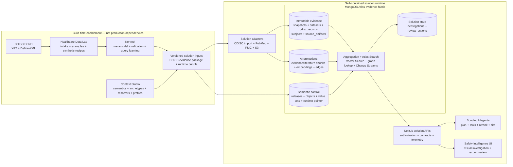

# Solution architecture

## Governing principle

CDISC SEND is the governed source and traceability contract. The deployed MongoDB model is an operational projection of that evidence, not a competing clinical standard. Every derived document retains a study, immutable snapshot, domain, and source reference so it can be traced to checksum-verified XPT and Define-XML artifacts.

## End-to-end architecture



Healthcare Data Lab, Kehrnel, and Context Studio produce versioned inputs. They are intentionally absent from the production request path. The running application owns its MongoDB database, API, Magenta service, policies, and user experience.

## Where CDISC is used

| SEND source | Semantic object | Operational representation | Purpose |
|---|---|---|---|
| TS | Study, Compound | `study_evidence.study`, `compounds` | Protocol and compound context |
| TX | TreatmentGroup | `study_evidence.doseGroups[]` | Dose, vehicle, and group assignment |
| DM | Subject | `subjects` | Animal identity, sex, and group |
| MI | Finding | `study_evidence.signals[]` | Organ, morphology, severity, and incidence |
| LB | LabMeasurement | `study_evidence.labSeries` | Longitudinal measurements and units |
| XPT + Define-XML | SourceArtifact | governed object storage plus lineage metadata | Definitions, replayability, and integrity |

The primary read model embeds data that the safety workspace reads together:

```javascript
{
  study: { id, snapshotId, implementationGuide },
  doseGroups: [{ code, dose, unit, animalCount }], // TX
  signals: [{ organ, finding, incidence, severity }], // MI
  labSeries: { testCode: { unit, points: [] } }, // LB
  provenance: { sourceRevision, sourceArtifacts }
}
```

This document is immutable for a published snapshot. Search documents, embedding vectors, semantic edges, investigations, and review actions have separate lifecycles and collections. They can evolve or be rebuilt without modifying observed SEND evidence.

## API surface

| Method | Route | Responsibility |
|---|---|---|
| GET | `/api/studies/{studyId}/signals` | Retrieve a snapshot-bound study evidence model |
| GET | `/api/studies/{studyId}/signals/{signalId}/records` | Resolve a visual signal to canonical subject, finding, lab, treatment, and artifact evidence |
| POST | `/api/investigations` | Execute a profile-authorized, cited evidence investigation |
| GET | `/api/literature` | Execute containment, lexical, optional vector, graph, fusion, and reranking stages |
| GET / POST | `/api/reviews` | Read or append governed expert review actions |
| GET | `/api/semantics` | Return the active semantic runtime projected for a profile |
| GET / SSE | `/api/semantics/stream` | Stream resume-safe semantic release and review events |
| POST | `/api/semantics/value-sets/observe` | Validate an observed term and compile a candidate semantic release |
| GET | `/api/health` | Expose configured data, agent, and review-store modes |

The browser only calls solution-owned APIs. It does not connect directly to Kehrnel, Context Studio, MongoDB, or Magenta. This keeps authorization and audit enforcement at a stable boundary while allowing storage and agent internals to evolve.

## Hybrid query path

1. Authorize the profile and bind the study and immutable snapshot.
2. Compile semantic containment from archetypes into an operational MongoDB plan.
3. Execute exact aggregation, Atlas Search, Vector Search, and graph traversal as complementary lanes.
4. Fuse candidates with reciprocal-rank fusion and apply domain-aware reranking.
5. Hydrate canonical records and attach source locators and execution telemetry.
6. Let Magenta synthesize a cited hypothesis for expert acceptance, revision, or rejection.

Exact CDISC-derived measurements remain authoritative. Vector similarity finds context; it never substitutes generated text for incidence, dose, severity, or laboratory values.

## Why the document model matters

- **Fidelity:** source domains, controlled terminology, revisions, and checksums remain explicit.
- **Workload fit:** closely related study facts can be read as one snapshot rather than repeatedly reconstructed from tabular joins.
- **Flexible enrichment:** text chunks, embeddings, relationships, literature, and future molecular projections can be added without changing the standard evidence.
- **Multi-modal retrieval:** the same platform supports exact filters, ranges, full-text search, vector similarity, and graph traversal.
- **Governed agents:** Context Studio profiles determine visible objects, masked fields, tools, and actions before Magenta can execute them.
- **Independent evolution:** semantic releases, retrieval projections, and reviewer state remain versioned separately from immutable source evidence.

The result is not “CDISC converted into an AI format.” It is a traceable evidence architecture where CDISC supplies meaning, MongoDB supplies operational shape, Context Studio supplies governed context, and Magenta supplies controlled interaction.
